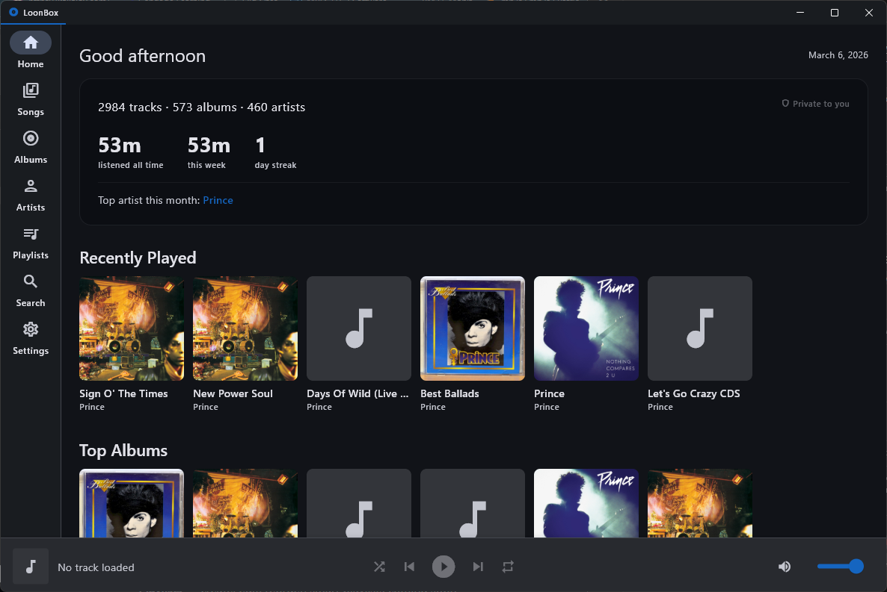
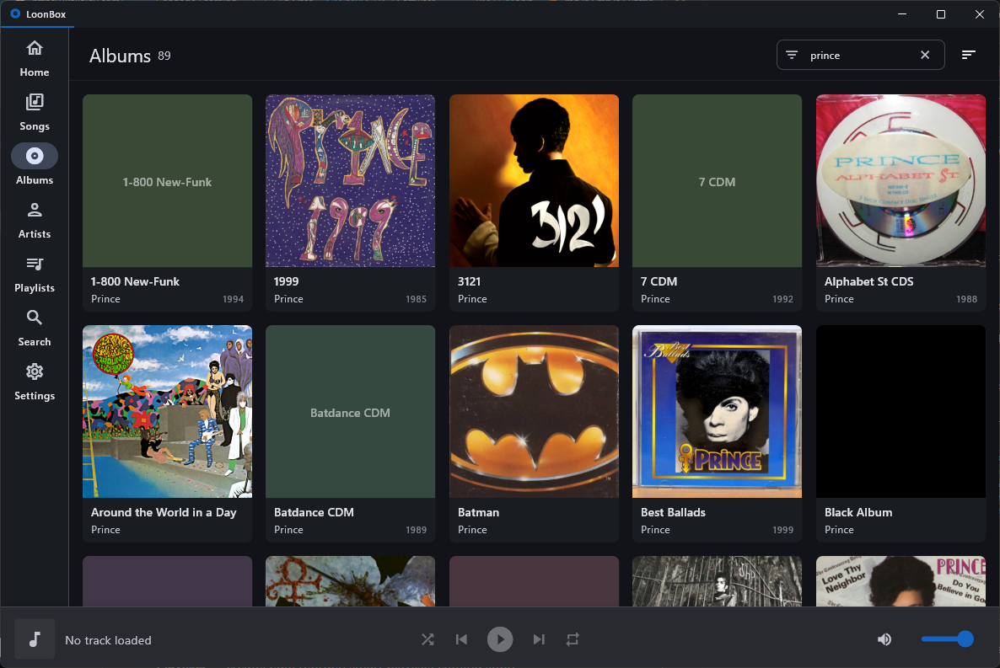
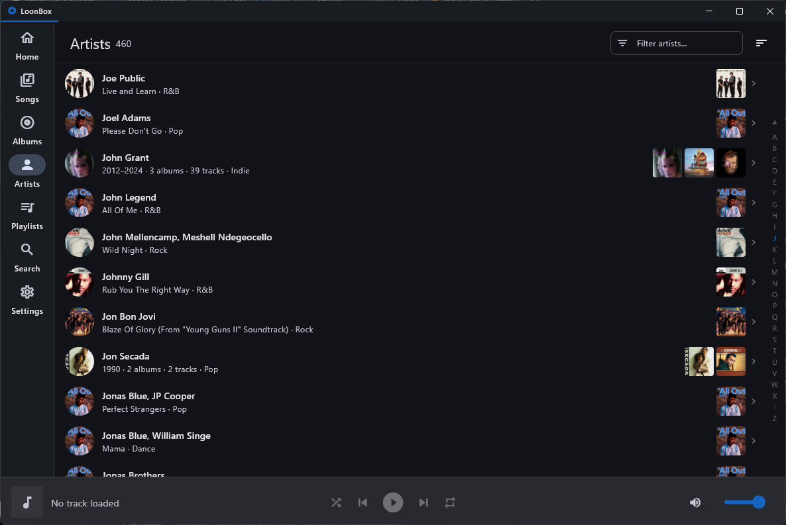
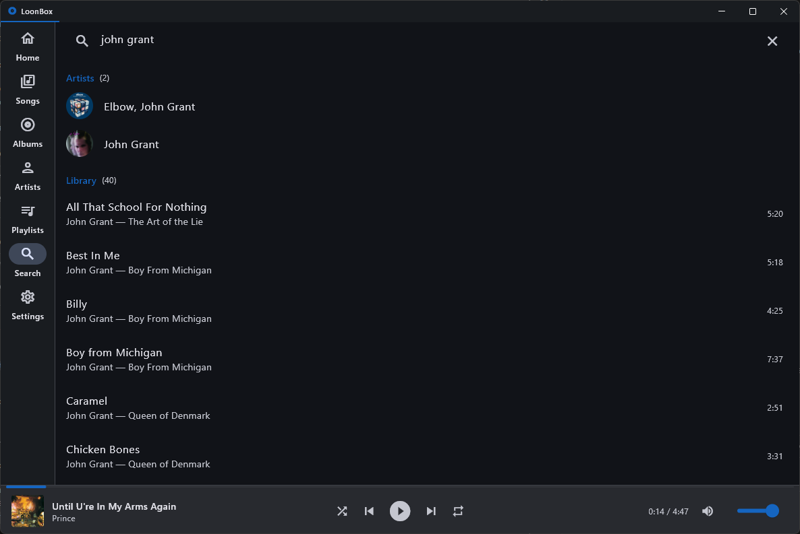
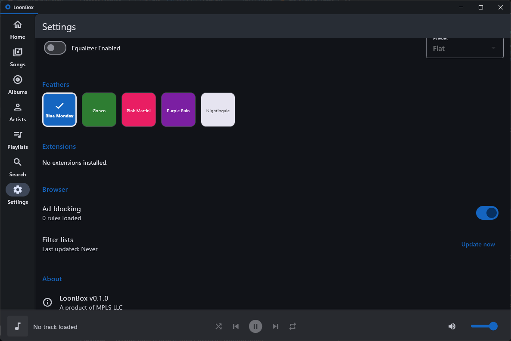

# LoonBox

A modern cross-platform music player built with Flutter and Rust. The spiritual successor to [Songbird](https://en.wikipedia.org/wiki/Songbird_(software)) and [Nightingale](http://getnightingale.com/).

A product of [MPLS LLC](https://mp.ls). Visit [loonbox.app](https://loonbox.app).

---

## Features

- **Local music library** — scan folders, watch for changes, full metadata extraction
- **Rust audio engine** — Symphonia decoder + cpal output with gapless playback and sample-rate resampling
- **MusicBrainz integration** — single-track lookup, album lookup, and full library auto-tag with confidence scoring
- **10-band parametric EQ** — 17 built-in presets, real-time DSP in the Rust pipeline
- **Audio visualizers** — spectrum analyzer, waveform, oscilloscope, VU meter
- **Embedded browser** — WebView2 with Rust filtering proxy and adblock
- **Feather theming** — 5 built-in feathers (Blue Monday, Purple Rain, Pink Martini, Gonzo, Nightingale) with full theme customization
- **Smart queue** — shuffle, repeat modes, queue management
- **Playlists** — create, edit, reorder; smart playlists coming soon
- **Keyboard shortcuts** — play/pause, next/prev, volume, mute
- **System tray** — minimize to tray, media controls from tray icon
- **Media keys** — Windows SMTC integration (media overlay + hardware keys)
- **i18n-ready** — all user-facing strings localized via ARB

## Tech Stack

| Layer | Technology |
|-------|-----------|
| UI & State | Flutter, Riverpod |
| Audio Engine | Rust (Symphonia + cpal), via flutter_rust_bridge |
| Metadata | Rust (lofty), MusicBrainz REST API |
| Database | Drift (SQLite) |
| Platform | Windows, Linux, macOS (no mobile for v1) |

## Heritage

LoonBox carries forward the spirit of Songbird (2006-2010, POTI Inc.) and its community fork Nightingale (2012-2018). While LoonBox is a ground-up rewrite — no XULRunner, no Gecko, no C++ — the design DNA of those projects lives on:

- **Feathers** (theming system) — Songbird coined the term; LoonBox inherits it
- **Extension architecture** — inspired by mashTape's provider plugin pattern
- **Library schema** — evolved from Songbird's EAV metadata model into a denormalized, type-safe schema
- **Smart playlists** — modernized from `sbILibraryConstraintBuilder` into a rule-based DSL

The git history of this repository preserves the full lineage — Songbird's initial import through Nightingale's final commits, followed by the LoonBox rewrite.

## Screenshots

<p align="center">
  
</p>

<p align="center">
  
  
</p>

<p align="center">
  
  
</p>

## Getting Started

See [BUILDING.md](BUILDING.md) for build instructions.

```bash
git clone https://github.com/mplsllc/LoonBox.git
cd LoonBox
flutter pub get
flutter_rust_bridge_codegen generate
flutter run
```

## Contributing

See [CONTRIBUTING.md](CONTRIBUTING.md) for guidelines.

By submitting a contribution, you agree to the [Contributor License Agreement](CLA.md).

## Roadmap

See [ROADMAP.md](ROADMAP.md) for the full development roadmap.

**Coming soon:**
- Feather shells (full layout transformations, including a Winamp-style skin)
- Lua extension system with The Nest marketplace
- Fullscreen visualizer mode with user-uploadable visualizers
- Tremolo (decentralized music distribution)
- Subsonic server integration

## License

LoonBox is licensed under the [GNU Affero General Public License v3.0](LICENSE).

**Ecosystem carve-out:** Feathers (themes) and extensions (plugins) that interact with LoonBox solely through the documented public APIs may be distributed under any license. See [LICENSE](LICENSE) for details.

## Links

- [loonbox.app](https://loonbox.app) — Official website
- [mp.ls](https://mp.ls) — MPLS LLC
- [GitHub](https://github.com/mplsllc/LoonBox) — Source code
